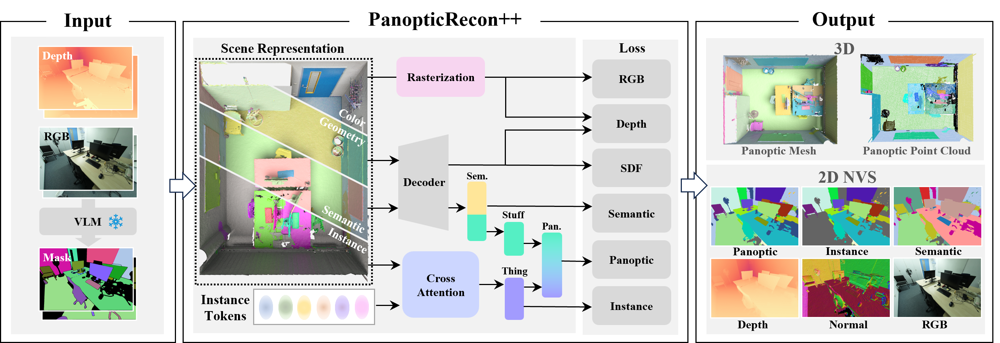
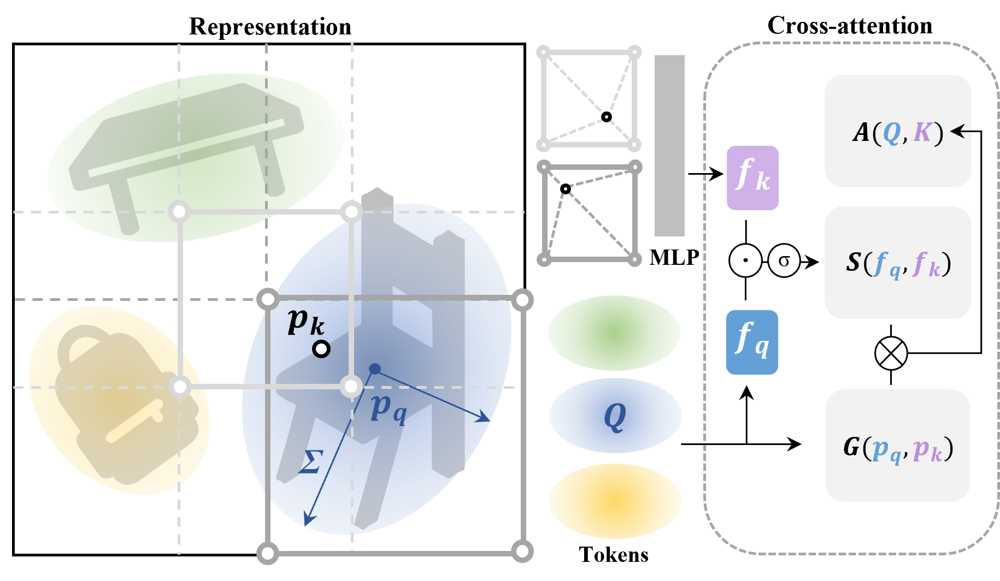

<h1 align="center">PanopticRecon++: Leverage Cross-Attention <br>for End-to-End Open-Vocabulary Panoptic Reconstruction</h1>

<p align="center">
<a href="https://arxiv.org/abs/2501.01119"></a>
<a href='https://yuxuan1206.github.io/panopticrecon_pp/'></a>
<a href='https://www.bilibili.com/video/BV1pP61YuEbm/?vd_source=16bffa885f8d40c0678b340384dd56db'></a>
</p>

<hr/>

<div>
<div style="text-align: center">
  
</div>
<div style="margin-top: 5px;">
We propose PanopticRecon++, an end-to-end open-vocabulary panoptic reconstruction method with multi-branch neural fields and 3D Gaussian-modulated instance tokens. 
</div>
</div>

<div style="margin-top: 20px;">
<div style="text-align: center">
  
</div>
<div style="margin-top: 5px; text-align: center;">
  <strong>Cross-Attention Token Mechanism:</strong> Our novel approach leverages cross-attention mechanisms to integrate multi-modal features for enhanced panoptic understanding.
</div>
</div>

<!-- ## Table of Contents

- [Dependencies](#dependencies)
- [Installation](#installation)
- [Project Structure](#project-structure)
- [Data Processing](#data-processing)
- [Quick Start](#quick-start)
- [Training](#training)
- [Mesh Generation](#mesh-generation)
- [Evaluation](#evaluation)
- [Pre-trained Models](#pre-trained-models)
- [Citation](#citation)
- [Acknowledgments](#acknowledgments) -->

## Dependencies

### System Requirements

- Python 3.8+
- CUDA 11.3+
- PyTorch 1.11.0+

### Core Libraries

The following packages are required and should be installed manually:

```bash
# Neural field and rendering
kaolin
kaolin-wisp
tiny-cuda-nn

# Computer vision and segmentation
GroundingDINO
segment-anything

# Geometry processing
sdf

```

## Installation

### Step 1: Environment Setup

```bash
# Create conda environment
conda create -n pr python=3.8
conda activate pr

# Install PyTorch (adjust CUDA version as needed)
pip install torch==1.11.0+cu113 torchvision==0.12.0+cu113 torchaudio==0.11.0 --extra-index-url https://download.pytorch.org/whl/cu113

```

### Step 2: Third-party Libraries

```bash
# Install GroundingDINO and SAM
pip install -e third-party/GroundingDINO
pip install -e third-party/segment_anything

# Install other required packages
pip install opencv-python matplotlib tqdm wandb hydra-core
```

### Step 3: Manual Installation (Required)

```bash
# 1. Kaolin (provided version)
cd kaolin
python setup.py develop

# 2. Kaolin-Wisp (provided version) 
cd ../kaolin-wisp
python setup.py develop

# 3. LieTorch
git clone https://github.com/princeton-vl/lietorch.git
cd lietorch
python setup.py install
./run_tests.sh

# 4. SDF
git clone https://github.com/fogleman/sdf
cd sdf
pip install -e .

# 5. Tiny-CUDA-NN
git clone https://github.com/nvlabs/tiny-cuda-nn
cd tiny-cuda-nn
cmake . -B build -DCMAKE_CUDA_COMPILER=/usr/local/cuda-11.3/bin/nvcc
cmake --build build --config RelWithDebInfo -j 16
cd bindings/torch
python setup.py install

```

### Step 4: Download Models

```bash
# Download GroundingDINO model
cd third-party/GroundingDINO
wget https://huggingface.co/ShilongLiu/GroundingDINO/resolve/main/groundingdino_swint_ogc.pth

# Download SAM model
cd ../segment_anything
wget https://dl.fbaipublicfiles.com/segment_anything/sam_vit_h_4b8939.pth
```

<!-- ## Project Structure

| Directory | Description |
|-----------|-------------|
| `config/` | Configuration files for different experiments |
| `data/` | Data processing utilities and scene configurations |
| `eval/` | Evaluation scripts and metrics |
| `Gaussian/` | Gaussian splatting related implementations |
| `instance/` | Instance segmentation models and processing |
| `models/` | Neural field model implementations |
| `render/` | Rendering utilities and visualization |
| `scripts/` | Data preprocessing and utility scripts |
| `third-party/` | External dependencies (GroundingDINO, SAM, etc.) |
| `utils/` | Helper functions and data tools | -->

## Data Processing

### Generate 2D Semantic and Instance Masks

Use GroundedSAM to generate 2D segmentation masks:

```bash
python scripts/groundsam_mask.py --dataset scannet --scene 0087_02 --box_threshold 0.25
```

**Available Parameters:**
- `--dataset`: Dataset name (scannet, scannet++, replica, etc.)
- `--scene`: Scene ID
- `--dataset_root`: Dataset root path  
- `--box_threshold`: Box threshold for GroundingDINO (default: 0.2)
- `--text_threshold`: Text threshold for GroundingDINO (default: 0.25)
- `--instance_threshold`: Instance threshold (default: 0.35)
- `--dino_config`: GroundingDINO config file path
- `--dino_model`: GroundingDINO model weights path
- `--sam_checkpoint`: SAM model checkpoint path

**Configuration:**
Scene-specific configurations are defined in `data/scene_config.py`. You can modify or extend these configurations as needed:

```python
def get_scene_config(dataset, scene_id, dataset_root):
    config = {
        "image_path": f"{dataset_root}/{scene_id}/color",
        "save_path": f"{dataset_root}/{scene_id}/groundsam_results",
        "text_prompt": "wall. floor. cabinet. bed. chair. sofa. table. door. window. bookshelf. picture. counter. desk. curtain. refrigerator. television. shower curtain. toilet. sink. bathtub. other furniture.",
        "class_name": ["wall", "floor", "cabinet", "bed", "chair", "sofa", "table", "door", "window", "bookshelf", "picture", "counter", "desk", "curtain", "refrigerator", "television", "shower curtain", "toilet", "sink", "bathtub", "other furniture"],
        "class_label": list(range(1, 22)),
        "thing": [False, False, True, True, True, True, True, True, True, True, True, True, True, True, True, True, True, True, True, True, True]
    }
    return config
```

## Training

### Configuration Files

- `config/[SCENE]/render_scannet_hash_++_all.yaml`

### Key Training Parameters

```yaml
# Dataset configuration
path:
  dataset_dir: /path/to/your/dataset
  proj_dir: /path/to/experiment/results

# Training settings
train:
  all_pose: [start_frame, end_frame]  # training frame range
  
frame:
  step: 1    # frame sampling interval
  num: 80    # frames per volume

mode2:
  epoch: 50  # training epochs

params:
  ray_chunk_mode2: 500  # rays per scan per iteration
  ray_chunk_img: 10     # image patches per iteration
  geometry_iter: 300    # geometry optimization iterations
```

### Example Training Commands

<!-- #### ScanNet Dataset -->
```bash
python main.py 
```

## Mesh Generation

### Marching Cubes Extraction

Configure mesh extraction in `mesh_test_better_hash.py`:

```python
# Sampling configuration
SAMPLES = 2 ** 27  # total sampling points (increase for higher resolution)

# Bounding box (adjust based on your scene)
x0, y0, z0 = -1, -0.8, -0.1  # minimum bounds
x1, y1, z1 = 1, 0.9, 0.1     # maximum bounds

# Model path
MODEL_PATH = "path/to/your/trained/model.pth"
```

Run mesh extraction:
```bash
python mesh_test_better_hash.py
```

**Output:**
- Geometric mesh: `<save_dir>/mesh/mesh_0_1.ply`
- Semantic mesh: `<save_dir>/mesh/mesh_semantic_0_1.ply`
- Instance mesh: `<save_dir>/mesh/mesh_instance_0_1.ply`

## Evaluation

### Rendering and Visualization

Configure rendering in `render/render_helper.py`:

```python
MODEL = 'path/to/model/checkpoint'
result_path = 'experiment_results/v0'
yaml_path = "config/render_scannet_hash_sem.yaml"

SCENE = ['camera']  # ['camera', 'lidar'] for different viewpoints
MODE = 'val'        # 'NVS' for novel view synthesis
```

Run rendering:
```bash
python render/render_imgs_hash_PR.py
```

### Quantitative Evaluation

#### 3D Semantic Evaluation
```bash
python eval/eval_semantic_3D.py \
  --pred_path path/to/predictions \
  --gt_path path/to/ground_truth \
  --dataset scannet
```

#### Segmentation Evaluation
```bash
# ScanNet evaluation
python eval/eval_segmentation_scannet.py --exp_path YOUR_EXP_PATH

# ScanNet++ evaluation  
python eval/eval_segmentation_scannetpp.py --exp_path YOUR_EXP_PATH

# Replica evaluation
python eval/eval_segmentation_replica.py --exp_path YOUR_EXP_PATH
```

<!-- ### Metrics

The evaluation scripts compute:
- **3D Semantic Segmentation**: mIoU, accuracy per class
- **3D Instance Segmentation**: AP, AP50, AP25
- **Panoptic Quality**: PQ, SQ, RQ
- **Geometric Quality**: Chamfer distance, F-score -->

<!-- ## Pre-trained Models

Download pre-trained models and example data:

```bash
# Download pre-trained models
wget https://link-to-pretrained-models.zip
unzip pretrained-models.zip

# Download example data
wget https://link-to-example-data.zip
unzip example-data.zip -d data/
``` -->

### Running Inference 

```bash
# Render with pre-trained model
python render/render_helper.py \
  --model_path pretrained/scannet_scene0423_02.pth \
  --config config/render_scannet_hash_sem.yaml \
  --output_path results/
```

## Citation

If you find this work useful in your research, please cite:

```bibtex
@article{yu2025leverage,
  title={Leverage cross-attention for end-to-end open-vocabulary panoptic reconstruction},
  author={Yu, Xuan and Xie, Yuxuan and Liu, Yili and Lu, Haojian and Xiong, Rong and Liao, Yiyi and Wang, Yue},
  journal={arXiv preprint arXiv:2501.01119},
  year={2025}
}
```

## Acknowledgments

This work builds upon several excellent projects:

- [3DGS]()
- [Panoptic Lifting](https://nihalsid.github.io/panoptic-lifting/) for panoptic neural field approach
- [GroundingDINO](https://github.com/IDEA-Research/GroundingDINO) for open-vocabulary object detection
- [Segment Anything](https://github.com/facebookresearch/segment-anything) for universal segmentation

## License

This project is licensed under the MIT License - see the [LICENSE](LICENSE) file for details.

## Contact

For questions and support, please:
- Open a GitHub issue
- Contact: [xuanyu@zju.edu.cn](mailto:xuanyu@zju.edu.cn)
